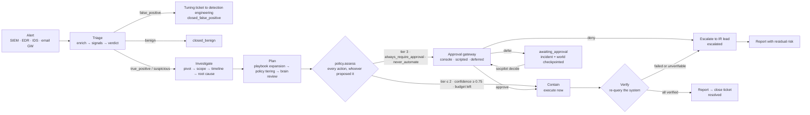
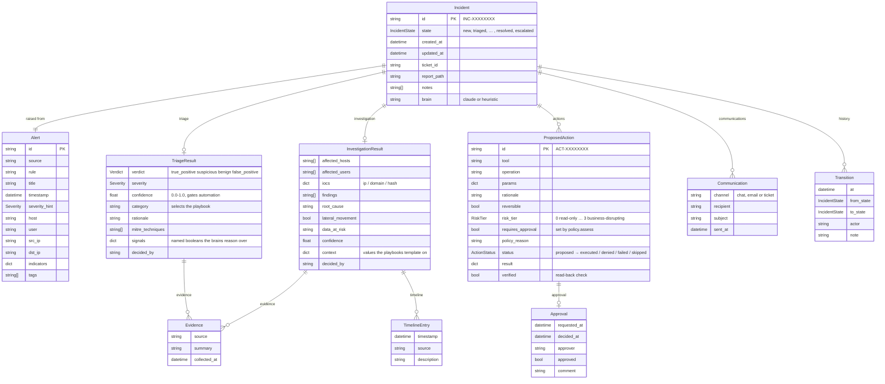
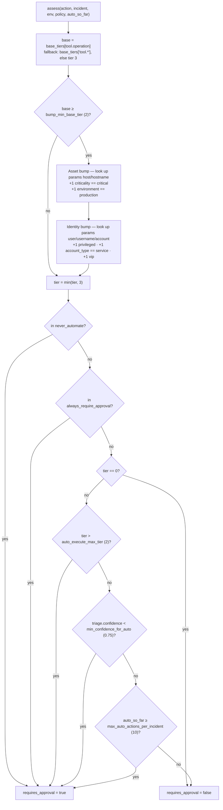

# SOC Autopilot

[](https://github.com/AbdulAlharbi/soc-autopilot/actions/workflows/ci.yml)
[](pyproject.toml)
[](tests/)
[](LICENSE)

An autonomous multi-agent system that owns one enterprise workflow end to end — SOC alert triage and incident response. A raw alert goes in; out comes a triage verdict with evidence, a scoped investigation, a containment plan executed and verified against the affected systems, notifications to the user, their manager, the asset owner and the IR lead, a resolved ticket and a written post-incident report. Five specialist agents are sequenced by an **Incident Commander**; every system call goes through one audited tool registry; and the boundary between "act on your own" and "ask a named human" is a YAML policy the model cannot argue with, not a line in a prompt. Reasoning is pluggable — Claude via the Anthropic Messages API, or a deterministic rule-based brain behind the same interface — so the whole workflow and its test suite run offline with no API key.



The workflow was chosen because it is the highest-volume, most repetitive job in a security team *and* because every action has a blast radius. That makes it a real test of the hard problem in agentic automation: not whether an agent can act, but whether it can be trusted to know which actions it may take alone.

---

## Requirements → design decisions

The brief: own an enterprise workflow end to end, make real decisions, interact with systems *and* people, and keep human intervention to a minimum. Decomposed:

| Requirement | Design decision | Why | Proof |
|---|---|---|---|
| **Own the workflow end to end** — alert in, closed incident out, no analyst babysitting | A state-machine orchestrator (`IncidentCommander`) sequences triage → investigate → plan → contain → verify → report → close, checkpointing the incident and the world after every phase. It never calls a tool itself. | Ownership means the terminal states, the ticket and the report are the agent's responsibility, not a human's follow-up task. A crash mid-incident must not lose the work already done. | `commander.py:86` `run()`, `commander.py:163` `_finalise()`, `commander.py:80` `_checkpoint()` · `tests/test_workflow.py:16` `test_scenario_reaches_expected_state` asserts, for all four scenarios, the expected terminal state, `not inc.pending_actions`, and that `report_path` **and** `ticket_id` are set |
| **The autonomy boundary is policy, not prompt** | Every `ProposedAction` — from a playbook or from the LLM — is passed through `policy.assess()`, which reads `config/policy.yaml`. The prompt cannot reach it. | A prompt-level rule ("ask before isolating servers") is advice; a code path every action must traverse is a control. The LLM can only *propose*. | `policy.py:60` `assess()`, `agents/responder.py:128` `_assess()` (applied to playbook actions at `:145` and to brain-added actions at `:168`) · `tests/test_policy.py:16` workstation isolation is autonomous vs `:22` `test_production_server_isolation_needs_a_human` — same operation, different target, opposite verdict |
| **One agent may change the world** | `BaseAgent.can_write = False`; only `ResponderAgent` sets it `True`. `ToolRegistry.call` refuses a non-read-only operation when the caller lacks write authority. | Prompt injection or a logic bug in Triage/Investigator/Communicator/Reporter cannot isolate a host — the refusal is structural, at the single choke-point all system calls pass through. | `agents/base.py:18` `can_write`, `agents/responder.py:108`, `tools/registry.py:96` raises `ToolError` · **no dedicated test** — verified manually in this session (`investigator attempted write operation edr.isolate_host without write authority`); see [Known gaps](#known-gaps) |
| **LLM output is a typed proposal, never a side effect** | Agents call `brain.decide(task, context, schema)` and get back a validated pydantic object (`TriageDecision`, `InvestigationDecision`, `ResponseDecision`). Malformed JSON gets one repair round, then the heuristic brain answers so the workflow never stalls. | Validation before state change means a hallucinated field is a parse error, not a firewall rule. Brain-added actions are additionally filtered to the containment catalogue and policy-assessed. | `llm/base.py:22` `Brain` protocol, `llm/claude.py:69` `decide()` (2 attempts then fallback), `agents/responder.py:163-169` catalogue filter + `_assess` · `tests/test_claude_brain.py:41,46,51,57` — parses plain JSON, strips fences/prose, `test_repairs_invalid_output_once` asserts `b.client.calls == 2`, `test_falls_back_to_heuristic_on_api_error` asserts the rationale carries `fallback` |
| **Two interchangeable brains** | `ClaudeBrain` and `HeuristicBrain` implement the same `Brain` protocol. `SOCPILOT_BRAIN=auto` picks Claude when `ANTHROPIC_API_KEY` is set, heuristic otherwise. The brain that made each call is recorded (`decided_by`, `Incident.brain`). | The rule brain is the floor the model must beat, the CI back-end, the offline demo, and the production fallback when the endpoint is down. Identical agent code either way. | `llm/base.py:30` `make_brain()`, `config.py:57` `resolve_brain()`, `llm/heuristic.py:33` · every test in `tests/test_workflow.py` runs the full pipeline on the heuristic brain (`tests/conftest.py:12` sets `brain = "heuristic"`); `tests/test_claude_brain.py` covers the Claude path with a stubbed client |
| **Verify actions, don't assume them** | After execution the Responder re-queries the simulated system for that specific effect (`_verify`). Executed-but-unverifiable actions push the incident to `escalated` rather than `resolved`. | "The API returned 200" is not containment. The mocks are stateful precisely so verification is a real read-back. | `agents/responder.py:222` `_verify()` (10 operation-specific read-back checks), `commander.py:166,176` unverified → `ESCALATED` · `tests/test_workflow.py:25` asserts `all(a.verified in (True, None))` for executed actions; `tests/test_workflow.py:66,92` assert the *world* changed (`edr.hosts[...]["isolated"]`, `"svc_backup" in env.iam.disabled`) |
| **Tamper-evident audit** | Every tool call, decision, approval and state transition is one JSON line whose SHA-256 covers the previous line's hash. `socpilot audit` walks and reports the chain. | A human trusting an autonomous system needs an after-the-fact record that cannot be quietly rewritten. | `audit.py:43` `record()`, `audit.py:69` `verify()` · `tests/test_workflow.py:95` `test_audit_chain_detects_tampering` rewrites line 5's payload and asserts `verify()` flips to false; `tests/test_workflow.py:27` asserts a valid chain with `n > 10` entries after every scenario |
| **Human in the loop, including asynchronously** | `ApprovalGateway.request()` returns an `Approval` or `None`. `None` means defer: the incident persists in `awaiting_approval` and a *different process* resumes it via `socpilot decide`. Approval requests carry rationale, tier reason, business service and what was already done. | Real approvals arrive over Slack minutes or hours later. A synchronous-only design would either block a worker or drop the incident. | `humans.py:33` `DeferredGateway`, `commander.py:148` `resume()`, `cli.py:93` `decide`, `agents/communicator.py:44` `request_approval()` · `tests/test_workflow.py:73` `test_deferred_approval_persists_and_resumes` — pauses, reloads the incident and `world.json` in a fresh `IncidentCommander`, asserts earlier autonomous work survived, then resumes to `resolved` |
| **False positives are work, not noise** | A `false_positive` verdict still runs a playbook: it opens a tuning ticket on the `detection-engineering` queue and closes as `closed_false_positive`, with no containment. | Silently suppressing a misfiring rule is how a SOC goes blind. The tuning request is routed to the team that owns the rule. | `commander.py:194` `_close_false_positive()`, `data/playbooks/recon_false_positive.yaml` · `tests/test_workflow.py:31` `test_false_positive_takes_no_containment_action` asserts no investigation ran, the only executed action is `ticketing.create_ticket`, `env.firewall.blocked` is empty, no host is isolated, and a ticket exists on the `detection-engineering` queue |

---

## Quick start

```bash
git clone https://github.com/AbdulAlharbi/soc-autopilot && cd soc-autopilot
python -m venv .venv && source .venv/bin/activate
pip install -e ".[dev]"

socpilot scenarios                                  # the four bundled alerts
socpilot run-all --brain heuristic                  # every scenario, auto-approving gated actions
socpilot run ransomware-precursor-server            # interactive: you are the approver
pytest -q                                           # 26 tests, <1s, no network
socpilot audit                                      # print the trail and verify the hash chain
```

`make install` / `make test` / `make demo` wrap the same commands. With `ANTHROPIC_API_KEY` set, the default `SOCPILOT_BRAIN=auto` selects Claude; without it, the heuristic brain. Copy `.env.example` to `.env` to configure.

### What a run looks like

`socpilot run-all --brain heuristic` (real output, this repo, heuristic brain — incident IDs are random per run):

```
                                                    summary
┏━━━━━━━━━━━━━━━━━━━━━━━━━━━━━┳━━━━━━━━━━━━━━┳━━━━━━━━━━━━━━━━┳━━━━━━━━━━┳━━━━━━━━━━━━━━━━━━━━━━━┳━━━━━━┳━━━━━━━┳━━━━━━━━┓
┃ scenario                    ┃ incident     ┃ verdict        ┃ severity ┃ final state           ┃ auto ┃ human ┃ denied ┃
┡━━━━━━━━━━━━━━━━━━━━━━━━━━━━━╇━━━━━━━━━━━━━━╇━━━━━━━━━━━━━━━━╇━━━━━━━━━━╇━━━━━━━━━━━━━━━━━━━━━━━╇━━━━━━╇━━━━━━━╇━━━━━━━━┩
│ beacon-c2-workstation       │ INC-73586FAF │ true_positive  │ high     │ resolved              │ 7    │ 0     │ 0      │
│ phishing-credential-theft   │ INC-C3FB04A4 │ true_positive  │ high     │ resolved              │ 9    │ 0     │ 0      │
│ port-scan-false-positive    │ INC-05320590 │ false_positive │ low      │ closed_false_positive │ 1    │ 0     │ 0      │
│ ransomware-precursor-server │ INC-DDDDB54C │ true_positive  │ critical │ resolved              │ 6    │ 4     │ 0      │
└─────────────────────────────┴──────────────┴────────────────┴──────────┴───────────────────────┴──────┴───────┴────────┘
```

`run-all` defaults to `--approvals approve`, so the ransomware scenario's four gated actions are approved by a scripted gateway and it reaches `resolved`. With `--approvals deny` those four are refused and it reaches `escalated` — the six autonomous actions stay in place and the residual risk is written into the report.

The plan table from a single run shows the tiering decision per action (`socpilot run ransomware-precursor-server --brain heuristic --approvals approve`, abridged):

```
 id            action                               tier  gate   status    verified  policy
 ACT-BAAF3340  edr.kill_process(host=SRV-ERP-01,    1     auto   executed  ✓         base tier 1 for edr.kill_process
               pid=7788)
 ACT-49BFED69  firewall.block_ip(ip=91.219.237.18)  1     auto   executed  ✓         base tier 1 for firewall.block_ip
 ACT-D2E02EC3  edr.isolate_host(host=SRV-ERP-01)    3     human  executed  ✓         tier 3 exceeds autonomy ceiling 2:
                                                                                     base tier 2 for edr.isolate_host;
                                                                                     S
 ACT-DD3AAC8E  edr.isolate_host(host=WS-IT-ADM-03)  2     auto   executed  ✓         base tier 2 for edr.isolate_host
 ACT-D51D8273  iam.disable_user(user=svc_backup)    3     human  executed  ✓         always requires approval by policy
 ACT-AAC9D9CF  edr.collect_forensics(host=SRV-ERP…  1     auto   executed  –         base tier 1 for
                                                                                     edr.collect_forensics
```

Two isolations by the same tool, in the same plan, land on opposite sides of the boundary: `WS-IT-ADM-03` is a corporate workstation (tier 2, auto), `SRV-ERP-01` is a critical production asset (2 + 1 + 1, capped at 3 → human). `verified –` means the operation has no read-back check defined (`edr.collect_forensics` produces a package, not observable state).

---

## Configuration

Everything is resolved from the environment at `Settings()` construction (`config.py`), with `--brain` and `--out` on the CLI overriding.

| Variable | Default | Effect | Source |
|---|---|---|---|
| `ANTHROPIC_API_KEY` | unset | Consumed by the `anthropic` SDK. Its presence is what makes `SOCPILOT_BRAIN=auto` resolve to `claude`. | `config.py:59` |
| `SOCPILOT_BRAIN` | `auto` | `auto` \| `claude` \| `heuristic`. `auto` → `claude` if the API key is set, else `heuristic`. | `config.py:21`, `config.py:57` |
| `SOCPILOT_MODEL` | `claude-sonnet-4-5` | Model id passed to `ClaudeBrain`. Ignored by the heuristic brain. | `config.py:22`, `llm/claude.py:47` |
| `SOCPILOT_OUT_DIR` | `<repo>/out` | Root for `incidents/`, `reports/`, `world.json`, `audit.jsonl`. | `config.py:19`, `config.py:42-55` |
| `SOCPILOT_POLICY` | `<repo>/config/policy.yaml` | Path to the autonomy policy. Point it at a stricter file per environment. | `config.py:20` |
| `SOCPILOT_TZ_OFFSET` | `3` (Riyadh) | Hours from UTC used to compute the `off_hours` triage signal against business hours 07:00–19:00 local. | `config.py:23-24`, `agents/base.py:38` |
| `SOCPILOT_IR_LEAD` | `ir-lead@corp.example` | Address notified on escalation and by any playbook with `role: ir_lead`. | `config.py:25`, `agents/communicator.py:82` |

Not environment-driven: `soc_channel` (`#soc-incidents`), `approvals_channel` (`#soc-approvals`) and `business_hours` are fields on `Settings` (`config.py:24,26,27`) — change them in code or by assigning to the `Settings` instance.

The substantive configuration is `config/policy.yaml`. Setting `auto_execute_max_tier: 1` makes the agents ask before resetting anyone's password; setting it to `3` lets them isolate production servers alone (except the `always_require_approval` list). See [the policy deep-dive](#the-autonomy-policy-engine).

---

## Usage

### `socpilot scenarios`
Lists the bundled alerts with their expected outcome.

```bash
socpilot scenarios
```

### `socpilot run <scenario>`
Runs the full workflow on one alert. `<scenario>` is a bundled name or a path ending in `.json`.

```bash
socpilot run phishing-credential-theft                             # interactive approvals (default)
socpilot run ransomware-precursor-server --approvals deny          # scripted denial → escalated
socpilot run beacon-c2-workstation --brain claude --no-show-chat   # Claude brain, no transcript
socpilot run ./my-alert.json --out /tmp/run1                       # own alert, own output dir
```

`--approvals` selects the gateway: `interactive` (prompt in the terminal, answer `approve`/`deny`/`defer`), `approve`, `deny`, or `defer` (`cli.py:32`). After the run the CLI compares the terminal state against the scenario's `expected` block and prints match/mismatch (`cli.py:142`).

### `socpilot run-all`
Every bundled scenario back to back, non-interactive, ending in the summary table above. Defaults to `--approvals approve`. It is the second command CI runs, after `pytest`.

```bash
socpilot run-all --brain heuristic
```

### `socpilot show <incident-id>` / `socpilot decide <incident-id> <action-id>`
Inspect a persisted incident, and record a human decision on a deferred action — which resumes the incident in that same process.

```bash
socpilot run ransomware-precursor-server --approvals defer     # pauses in AWAITING_APPROVAL
socpilot show INC-50D2520D
socpilot decide INC-50D2520D ACT-248DE1F7 --approve --as f.zahrani -c "ERP maintenance window opened"
socpilot decide INC-50D2520D ACT-99E6B10E --deny    --as f.zahrani -c "payroll run in progress"
```

`decide` loads the incident from `out/incidents/`, loads the world as the agents left it from `out/world.json`, applies the `Approval`, and calls `commander.resume()`. Approving one of four gated actions executes that one and leaves the incident in `awaiting_approval` for the rest; the last decision drives it to `resolved` (all approved) or `escalated` (any denied).

### `socpilot audit [incident-id]`
Prints the trail — optionally filtered to one incident — and verifies the hash chain, e.g. `chain valid · 60 entries`.

### One incident, in sequence

The ransomware scenario with deferred approvals. Note the transaction-like boundary in the containment phase: **every autonomous action is executed and verified before the first approval request is raised**, so the human decides with the cheap containment already in place and is told so in the request.

```mermaid
sequenceDiagram
    autonumber
    participant CLI as socpilot CLI
    participant C as IncidentCommander
    participant T as TriageAgent
    participant I as InvestigatorAgent
    participant R as ResponderAgent
    participant P as policy.assess
    participant TR as ToolRegistry + mocks
    participant M as CommunicatorAgent
    participant H as Human

    CLI->>C: run(alert)
    C->>T: run(incident)
    T->>TR: assets.get · iam.get_user · threat_intel.lookup · edr.get_host · siem.search ±6h
    T->>T: compute named signals
    T-->>C: TriageDecision true_positive / critical / 0.97 / ransomware
    C->>M: open_ticket → ticketing.create_ticket + chat.post
    C->>I: run(incident)
    I->>TR: pivot user → hosts → IPs → asset owners → auth history (read-only only)
    I-->>C: InvestigationResult 3 hosts, 2 users, lateral, playbook context
    C->>R: plan(incident)
    R->>R: expand ransomware.yaml against context → 10 actions
    loop every action, playbook or brain-proposed
        R->>P: assess(action, incident, env, policy, auto_so_far)
        P-->>R: tier + requires_approval + reason
    end

    rect rgb(226, 244, 230)
        Note over R,TR: Phase 1 — safe actions, no human in the path
        R->>TR: kill_process ×2 · block_ip ×2 · isolate WS-IT-ADM-03 · collect_forensics
        TR-->>R: results
        R->>TR: re-query each → verified = true
    end

    rect rgb(253, 243, 220)
        Note over R,H: Phase 2 — gate the remaining 4 (tier 3 / always-ask)
        R->>M: on_approval_request(action)
        M->>TR: chat.post to #soc-approvals with rationale, tier reason,<br/>business service and 'already done autonomously'
        R->>H: gateway.request(incident, action)
        H-->>R: None (deferred)
    end

    C->>C: state = awaiting_approval; checkpoint incident + world.json
    C-->>CLI: paused

    Note over CLI,H: minutes or hours later, a different process
    H->>CLI: socpilot decide INC-… ACT-… --approve --as f.zahrani
    CLI->>C: load incident + world → resume(incident)
    C->>R: execute(incident, gateway)
    R->>TR: isolate SRV-ERP-01 · disable svc_backup · reset r.otaibi
    R->>TR: re-query each → verified = true
    C->>C: no denied / failed / unverified → contained → resolved
    C->>M: notify stakeholders · resolve ticket
    C->>C: reporter.write → out/reports/INC-….md
```

If any gated action is denied, `_finalise` takes the `escalated` branch instead: the executed actions stay in place, the IR lead is emailed, and the report documents the residual risk (`commander.py:163-180`).

---

## Architecture

### Domain model

Everything an agent produces is a typed pydantic object; an LLM never mutates state directly (`models.py`).



Three further schemas exist only as *what the model is asked to return*: `TriageDecision`, `InvestigationDecision` (whose `follow_up_queries` are nested `ToolRequest`s) and `ResponseDecision` (`drop` reasons plus `add`ed `ActionSpec`s). They are validated first, then mapped into the domain objects above.

### Incident Commander (`commander.py`)

The orchestrator and the only stateful thing in the system. It owns the state machine, calls the specialists in order, and decides when the workflow is done. It never calls a tool.

```
new ─▶ triaged ─┬─▶ closed_false_positive        (tuning ticket raised first)
                ├─▶ closed_benign
                └─▶ investigating ─▶ planning ─▶ containing ─┬─▶ contained ─▶ resolved
                                                             ├─▶ awaiting_approval ─▶ containing (resume)
                                                             └─▶ escalated  (denied / failed / unverifiable)
```

`_checkpoint()` writes the incident to `out/incidents/INC-*.json` and the whole simulated world to `out/world.json` after every transition, which is what makes deferred approval — and crash recovery — work. `IncidentStore` (`commander.py:36`) is the persistence layer.

### Agents (`agents/`)

| Agent | `can_write` | Reads | Writes | Asks the brain for |
|---|---|---|---|---|
| **Triage** (`triage.py`) | no | assets, IAM profile, TI on every alert IOC, scanner allowlists, EDR host + suspicious processes, SIEM ±6h | — | `TriageDecision`: verdict, severity, confidence, category, MITRE. Computes 22 named **signals** first, so the decision is explainable and the rule brain has something to reason over |
| **Investigator** (`investigator.py`) | no | SIEM pivots (user → host → src IP → asset owner → auth history), EDR per host, TI on every discovered IOC, identity change log, email campaign scope | — | `InvestigationDecision`: findings, root cause, lateral movement, data at risk. May request up to 3 read-only follow-up queries per round, 2 rounds (`MAX_FOLLOWUP_ROUNDS`), each checked against the registry and rejected if unknown or not read-only |
| **Responder** (`responder.py`) | **yes** | policy, playbooks, investigation context | **all containment tools** | `ResponseDecision`: `drop` (with reasons → status `skipped`) and `add` (must exist in the containment catalogue, then policy-assessed) |
| **Communicator** (`communicator.py`) | no | IAM (who to notify, manager chain), assets (owner, business service) | ticket, chat, mail (tier-0 operations) | Narrated approval requests and user notifications, drafted from structured context |
| **Reporter** (`reporter.py`) | no | the incident object | the report file | An executive summary; the rest of the Markdown is deterministic |

Write authority is enforced in `ToolRegistry.call` from the agent's `can_write` flag, not by convention.

**Signals** are the hinge of the design. Triage does not hand the model a pile of JSON and hope — it computes named booleans and counts (`allowlisted_source`, `ti_malicious`, `suspicious_process_count`, `impossible_travel`, `mailbox_rule_created`, `oauth_consent`, `beaconing`, `shadow_copy_deletion`, `backup_tampering`, `exfil_staging`, `service_account_interactive_logon`, `credential_access_attempted`, `off_hours`, `user_privileged`, …). Both brains reason over the same signals plus the raw evidence; the fired signals are printed in the report so a reviewer can see *why*; and playbooks can condition on them (`when: signals.mailbox_rule_created`).

### Brain interface (`llm/`)

```python
class Brain(Protocol):
    name: str
    def decide(self, task, context: dict, schema: type[T], system: str = "") -> T: ...   # validated pydantic
    def narrate(self, task, context: dict, system: str = "") -> str: ...                  # prose for humans
```

- **`ClaudeBrain`** (`llm/claude.py`) — Anthropic Messages API, `temperature=0.1`, `max_tokens=2500`, context JSON truncated at 40 000 chars. The prompt embeds `schema.model_json_schema()` and demands JSON only; responses are unwrapped from surrounding prose or markdown code fences, validated, and on failure fed back once for repair. After two failed attempts, or on any network/auth/rate-limit exception, it delegates to the heuristic brain and prefixes the rationale with `[heuristic fallback after model error: …]` so the fallback is visible in the report and the audit log.
- **`HeuristicBrain`** (`llm/heuristic.py`) — explicit rules over the same signals: an additive evidence score (malicious TI +0.3 each capped at 0.5, suspicious process +0.25, shadow-copy/backup tampering +0.35, impossible travel +0.2, beaconing +0.2, mailbox rule +0.2, exfil staging +0.15, service-account interactive logon +0.15, …) that maps to `true_positive` at ≥ 0.5 and `suspicious` at ≥ 0.2, with a hard rule-0 short-circuit for an allowlisted scanner inside its change window. Deterministic, dependency-free, and the reason CI and the demo need no API key.

### Tool registry and mocks (`tools/`)

`ToolRegistry` is the single path from any agent to any system (`registry.py:94`). It validates the operation exists, enforces write authority, executes, and records the call, parameters and (truncated to 600 chars) result in the audit log — including failures, as a `tool_error` entry. It also exposes `catalogue(read_only=…)`, which is what the LLM is shown so it can only propose operations that exist.

24 operations across 10 system namespaces, split 12/12:

- **Callable without write authority (tier 0):** `siem.search`, `siem.auth_history`, `edr.get_host`, `threat_intel.lookup`, `iam.get_user`, `assets.get`, `email_gateway.find_messages`, plus the notification/tracking calls `ticketing.create_ticket|update_ticket|resolve_ticket`, `chat.post`, `mail.send`. The `read_only` flag on these last five means "no write authority required", not "no side effect" — they are how the system talks to people, and policy tiers them at 0.
- **Containment (write authority required):** `firewall.block_ip|block_subnet`, `email_gateway.quarantine_message`, `iam.remove_mailbox_rules|revoke_oauth_grant|revoke_sessions_and_reset_password|enforce_mfa_reregistration|disable_user`, `edr.scan_host|collect_forensics|kill_process|isolate_host`.

`MockEnvironment` (`tools/environment.py`) holds `SIEM`, `EDR`, `IAM`, `ThreatIntel`, `EmailGateway`, `Firewall`, `Ticketing`, `Chat`, `Mail` and `Allowlists`, loaded from `data/fixtures/`. They are **stateful on purpose**: `edr.isolate_host` flips a flag that `edr.get_host` returns afterwards, `iam.remove_mailbox_rules` actually deletes the entry from the user's change log — which is what makes the Responder's verification a real read-back rather than a tautology. `snapshot()`/`restore()`/`save()`/`load()` persist the whole world to `out/world.json` so it survives between CLI invocations.

Swapping a mock for a real product means implementing the same method signatures against the vendor API and registering it — see [`docs/INTEGRATIONS.md`](docs/INTEGRATIONS.md) for the mapping to Splunk/Sentinel, CrowdStrike/Defender, Entra ID, Proofpoint, Palo Alto, Jira/ServiceNow and Slack.

### Human gateways (`humans.py`)

`ApprovalGateway.request(incident, action) -> Approval | None`. Three implementations: `InteractiveGateway` (rich panel in the terminal showing the action, its rationale, the tier reason, the business impact and everything already done; answers `approve` / `deny` / `defer`), `AutoGateway` (scripted, for tests and `run-all`), and `DeferredGateway` (returns `None`). A Slack bot is the same interface: post with buttons, return `None`, and have the interaction webhook call `socpilot decide`.

---

## The autonomy policy engine

This is the part that makes the system safe to point at real infrastructure, and the part worth reading the code for. It is 140 lines of `policy.py` with no LLM anywhere in it.

Every action carries a **risk tier** (`models.py:69`):

| Tier | Meaning | Examples |
|---|---|---|
| 0 | Read-only or notification | `siem.search`, `chat.post`, `ticketing.create_ticket` |
| 1 | Reversible, narrow blast radius | `firewall.block_ip`, `edr.kill_process`, `email_gateway.quarantine_message` |
| 2 | Disruptive to one user or host | `edr.isolate_host`, `iam.revoke_sessions_and_reset_password` |
| 3 | Disruptive to the business | `iam.disable_user`, `firewall.block_subnet` |

`assess()` (`policy.py:60`) computes the final tier and the gate:



Expressed as an expression:

```
final_tier = base_tier(tool.operation)
           + (critical_asset ? +1) + (production ? +1)            # only if base_tier ≥ bump_min_base_tier
           + (privileged ? +1) + (service_account ? +1) + (vip ? +1)
           capped at 3

requires_approval = op ∈ never_automate
                  ∨ op ∈ always_require_approval
                  ∨ final_tier > auto_execute_max_tier
                  ∨ triage.confidence < min_confidence_for_auto
                  ∨ auto_actions_executed ≥ max_auto_actions_per_incident
```

Every clause carries its weight:

- **Unknown operations fail closed.** A tool with no entry in `base_tiers` and no `tool.*` wildcard gets `RiskTier.HIGH` (`policy.py:70`). Adding a tool without adding a tier makes it human-gated, not silently automatic.
- **`bump_min_base_tier: 2` is the rule that makes the whole thing usable.** Without it, everything touching a production server would escalate and the agent would ask a human twelve times per incident — approval fatigue, and the pattern that gets automation switched off. With it, bumps only escalate operations that are *already* disruptive. Killing one malicious process or collecting forensics on the critical ERP server stays tier 1 and runs autonomously; isolating that same server goes 2 → 3 and stops for a human. Proof: `tests/test_policy.py:29` `test_low_tier_actions_are_not_bumped_by_asset` — `edr.kill_process` on `SRV-ERP-01` stays `RiskTier.LOW` with no approval, while `tests/test_policy.py:22` shows `edr.isolate_host` on the same host becomes `RiskTier.HIGH` with `"critical asset"` and `"production"` in the reason.
- **Bumps read the environment, not the alert.** The asset bump looks up `params["host"]` in the asset inventory; the identity bump looks up `params["user"]` in the directory. The same `iam.revoke_sessions_and_reset_password` is tier 2 and autonomous for the finance analyst `j.alrashid` and tier 3 and gated for the sysadmin `r.otaibi` (`tests/test_policy.py:41` `test_privileged_user_bumps_tier`). The parameter names searched are configurable (`host_params`, `user_params`).
- **The confidence gate ties autonomy to evidence.** Triage confidence below `min_confidence_for_auto` (0.75) sends *everything* to a human regardless of tier — a shaky verdict should not produce confident action (`tests/test_policy.py:47`).
- **The budget is a circuit breaker.** After `max_auto_actions_per_incident` (10) autonomous executions, the rest of the plan is gated. It is a runaway guard, not a rate limiter (`tests/test_policy.py:53`).
- **`always_require_approval` overrides the tier arithmetic.** `iam.disable_user` and `firewall.block_subnet` are business decisions even if some future tier arrangement would let them through (`tests/test_policy.py:35`).
- **`never_automate` is checked first and is absolute.** `edr.wipe_host` and `iam.delete_user` are on it — deliberately including operations that are *not implemented in the registry*, so the guard exists before the capability does (`tests/test_policy.py:59`).
- **Tier 0 short-circuits.** Read-only and notification operations never gate, so the system can always talk to people even mid-approval.

The verdict is not just a boolean: `PolicyVerdict.reason` is a human-readable trace (`"tier 3 exceeds autonomy ceiling 2: base tier 2 for edr.isolate_host; SRV-ERP-01 is a critical asset (+1); SRV-ERP-01 is in production (+1)"`) that is stored on the action, shown in the CLI table, included in the approval request the human reads, and written into the report.

**The LLM cannot route around any of this.** Playbook actions are assessed at `responder.py:145`; actions the brain *adds* are first filtered against the containment catalogue (`responder.py:164`, unknown or read-only adds are rejected and logged as `plan_add_rejected`) and then assessed through the identical `_assess` call at `responder.py:168`. The Investigator's follow-up queries are similarly checked to be registered *and* read-only before they run (`investigator.py:175`).

### Playbooks

Response plans are YAML keyed by triage category (`data/playbooks/*.yaml`), expanded against the Investigator's `context` dict:

- `{user}`, `{host}`, `{src_ip}`, `{alert_rule}` — whole-value placeholders keep their native type (`tests/test_responder.py:12` asserts a rendered `pid` is still an `int`)
- `{each:malicious_ips}` — fans out to one action per value (`tests/test_responder.py:7`)
- `when: signals.mailbox_rule_created` — dotted-path condition; false means the action is never created (`tests/test_responder.py:21`)
- an unresolvable placeholder **drops** the action rather than sending `None` to a production system (`tests/test_responder.py:17`)
- embedded placeholders render as text inside a larger string (`tests/test_responder.py:27`)

If no playbook file matches the category, `Playbook.load` falls back to `generic_suspicious.yaml`, which collects forensics and hands a documented package to a human. `notify` lists the roles the Communicator resolves to real people: `user`, `manager`, `asset_owner`, `ir_lead`.

---

## Scenarios

Four alerts in `data/scenarios/`, each with fixtures that make the investigation land somewhere real. Outcomes below are from an actual `--brain heuristic` run.

| Scenario | Triage | Final state | Autonomous actions | Human-gated actions |
|---|---|---|---|---|
| **phishing-credential-theft**<br/>AiTM phishing → token replay from Lagos → OAuth consent + forwarding rule | `true_positive` / high / 0.97<br/>`credential_compromise` | `resolved` | **9, all of them:** revoke sessions + reset password, enforce MFA re-registration, remove the mailbox rule, revoke the `APP-7f31` OAuth grant, block `197.210.53.14`, quarantine the campaign from 3 mailboxes, scan `WS-FIN-017`. User and manager emailed. | none — the target is an unprivileged corporate user on a low-criticality workstation, so nothing exceeds tier 2 |
| **beacon-c2-workstation**<br/>Macro doc → unsigned loader → 60 s beacon with 1.8 % jitter to a Cobalt Strike server | `true_positive` / high / 0.97<br/>`malware_c2` | `resolved` | **7:** isolate `WS-ENG-042` (tier 2), kill pid 4412, block `45.147.230.221` estate-wide, collect forensics, quarantine the macro doc from 2 mailboxes, reset `a.khan`'s credentials (triggered by the `credential_access_attempted` signal) | none |
| **port-scan-false-positive**<br/>IDS fires on the scheduled, change-managed Nessus scan | `false_positive` / low / 0.93<br/>`recon_false_positive` | `closed_false_positive` | **1:** a tuning ticket on the `detection-engineering` queue naming the rule, the allowlisted source and its change reference `CHG-20260812-044` | none. No investigation runs, no containment happens |
| **ransomware-precursor-server**<br/>Hijacked admin VPN session → service account over RDP → shadow-copy deletion + `rclone` exfil staging on the production ERP server | `true_positive` / critical / 0.97<br/>`ransomware` | `resolved` (approve)<br/>`escalated` (deny) | **6:** kill `vssadmin` pid 7788 and `rclone` pid 7801, block `91.219.237.18` and `31.216.148.10`, isolate `WS-IT-ADM-03` (tier 2 workstation), collect forensics | **4:** isolate `SRV-ERP-01` (tier 3, critical + production), isolate `SRV-FS-03` (tier 3), disable `svc_backup` (always-ask), reset the privileged admin `r.otaibi` (tier 3, privileged bump). Deny → IR lead emailed, six executed actions stay in place, residual risk in the report |

The `closed_benign` terminal state (real but authorised activity) is implemented at `commander.py:103` but no bundled scenario reaches it.

Sample outputs: [`docs/sample-report-ransomware.md`](docs/sample-report-ransomware.md), [`docs/sample-report-phishing.md`](docs/sample-report-phishing.md).

---

## Testing

26 tests, no network, no API key, sub-second.

```
$ pytest -q
..........................                                               [100%]
26 passed in 0.45s
```

**Unit — `tests/test_policy.py` (8 tests).** The autonomy boundary, pinned operation by operation: workstation isolation is autonomous; the same operation on a critical production server is tier 3 and gated with both bump reasons in the text; a tier-1 operation on that same server is *not* bumped; `iam.disable_user` is always gated; the privileged-user bump; the confidence gate; the automation budget; and `never_automate` as an absolute.

**Unit — `tests/test_responder.py` (5 tests).** Playbook templating in isolation, no environment: `{each:}` fan-out, native-type preservation for whole-value placeholders, action-dropping on an unresolved placeholder, `when:` conditions in both directions, and embedded placeholders rendering as text.

**Unit — `tests/test_claude_brain.py` (4 tests).** The Claude contract, with a stubbed client that never touches the network (`pytest.importorskip("anthropic")` skips the file if the SDK is absent): plain JSON parses; markdown fences and surrounding prose are stripped; invalid output triggers exactly one repair round (`client.calls == 2`); an API exception falls through to the heuristic brain with `fallback` recorded in the rationale.

**Integration — `tests/test_workflow.py` (9 tests).** The whole pipeline against the mock estate on the heuristic brain:

- `test_scenario_reaches_expected_state` — parametrized over all four scenarios: verdict, category and terminal state match the scenario's own `expected` block, nothing is left pending, every executed action is `verified in (True, None)`, a report and a ticket exist, and the audit chain verifies with more than 10 entries.
- `test_false_positive_takes_no_containment_action` — no investigation, only a ticket, an empty firewall block list, no isolated host, and a ticket on the `detection-engineering` queue.
- `test_phishing_is_fully_autonomous_and_contains_campaign` — run with a *denying* gateway to prove no human is ever consulted; then asserts the real end state of the world: `j.alrashid` in `iam.reset` and `iam.mfa_reset`, the attacker IP blocked, every message from the phishing domain `quarantined`, the mailbox rule gone, and mail delivered to both the user and their manager.
- `test_ransomware_gates_business_impacting_actions` — the ERP isolation and the service-account disable are in the gated set; kill/block/forensics executed autonomously; `WS-IT-ADM-03` isolated but `SRV-ERP-01` not; `svc_backup` not disabled; an approval request posted to `#soc-approvals`; the IR lead emailed; and the investigation independently discovered `r.otaibi` and flagged lateral movement.
- `test_deferred_approval_persists_and_resumes` — pauses in `awaiting_approval`, checks `world.json` exists, reloads incident and world in a **fresh** `IncidentCommander`, confirms the earlier autonomous isolation survived the process boundary, resumes to `resolved`, and asserts the gated effects landed.
- `test_audit_chain_detects_tampering` — runs a scenario, verifies the chain, rewrites a payload field on line 5 to make a tool call look like its opposite, and asserts `verify()` now returns false.

**CI** (`.github/workflows/ci.yml`) runs on every push and pull request across Python 3.11 and 3.12: `pip install -e ".[dev]"`, then `pytest -q`, then `socpilot run-all --brain heuristic` — so a regression that keeps the tests green but breaks the demo still fails the build.

---

## Extending

### Add a tool

Four edits, in this order. Skipping the policy entry is safe — an unknown operation defaults to tier 3 and gets gated.

```python
# 1. src/socpilot/tools/environment.py — the simulated (or real) system
class Firewall:
    def __init__(self) -> None:
        self.blocked: list[str] = []
        self.blocked_domains: list[str] = []          # add to snapshot()/restore() to survive `decide`

    def block_domain(self, domain: str, reason: str = "") -> dict[str, Any]:
        if domain not in self.blocked_domains:
            self.blocked_domains.append(domain)
        return {"domain": domain, "blocked": True, "reason": reason}
```

```python
# 2. src/socpilot/tools/registry.py — inside _register_all(), under "containment"
self._add("firewall.block_domain", "Sinkhole a domain at the DNS/proxy layer.",
          {"domain": "str"}, False, env.firewall.block_domain)
```

```yaml
# 3. config/policy.yaml — under base_tiers
  firewall.block_domain: 1        # reversible, estate-wide but narrow
```

```python
# 4. src/socpilot/agents/responder.py — inside _verify(), so the action is checked, not assumed
if act.key == "firewall.block_domain":
    return p["domain"] in env.firewall.blocked_domains
```

The tool is now visible in `catalogue(read_only=False)`, so the brain may propose it in `ResponseDecision.add`; it will be policy-assessed like everything else.

### Add a playbook

Drop a YAML file named after a triage category into `data/playbooks/`:

```yaml
# data/playbooks/data_exfiltration.yaml
name: data_exfiltration
description: Cut the exfil channel, preserve evidence, and lock the identity doing it.
mitre: [T1567.002, T1048, T1074.001]
notify:
  - role: asset_owner
  - role: ir_lead
actions:
  - tool: edr
    operation: kill_process
    params: {host: "{host}", pid: "{each:malicious_pids}"}
    rationale: Stop the transfer immediately; contained to one process.
    reversible: false
  - tool: firewall
    operation: block_domain
    params: {domain: "{each:exfil_domains}"}
    rationale: Sinkhole the destination for the whole estate.
    reversible: true
  - tool: iam
    operation: revoke_sessions_and_reset_password
    params: {user: "{user}"}
    when: signals.credential_access_attempted
    rationale: Credentials were touched on the same host; assume exposure.
    reversible: false
  - tool: edr
    operation: collect_forensics
    params: {host: "{host}"}
    rationale: Preserve evidence before remediation destroys it.
    reversible: true
```

Two things must line up for it to be selected:

1. **A brain has to return the category.** `ClaudeBrain` is constrained by the list in `TRIAGE_SYSTEM` (`agents/triage.py:18`) — add `data_exfiltration` there. `HeuristicBrain._triage` picks from a fixed set (`llm/heuristic.py:106-115`); add a branch there *and* a `MITRE_BY_CATEGORY` entry (`llm/heuristic.py:24`), which is indexed directly and will raise `KeyError` if missing.
2. **Any new template key must exist in the context.** `{each:exfil_domains}` has to be produced by `InvestigatorAgent.run` into `playbook_ctx` (`agents/investigator.py:190`) or by `ResponderAgent.build_context` (`agents/responder.py:115`). If it is absent the action is silently dropped — which is the safe failure, but a silent one.

An unmatched category falls back to `generic_suspicious.yaml`.

### Add a scenario

```json
// data/scenarios/insider-mass-download.json
{
  "name": "insider-mass-download",
  "description": "Departing employee bulk-downloads the finance file share to a personal device.",
  "expected": {"verdict": "true_positive", "final_state": "resolved", "category": "data_exfiltration"},
  "alert": {
    "id": "ALR-2026-0910-0912",
    "source": "siem",
    "rule": "DLP-Bulk-File-Access",
    "title": "s.alqahtani read 4,812 files from SRV-FS-03 in 11 minutes",
    "description": "Access volume 40x the user's 30-day baseline, followed by an outbound transfer.",
    "timestamp": "2026-09-10T06:12:00Z",
    "severity_hint": "high",
    "host": "SRV-FS-03",
    "user": "s.alqahtani",
    "src_ip": "10.20.14.31",
    "indicators": {"file_count": 4812, "bytes": 9214000000},
    "tags": ["dlp", "exfiltration", "insider"]
  }
}
```

It is picked up automatically by `socpilot scenarios`, `socpilot run insider-mass-download` and `socpilot run-all`. To make the investigation find anything, add matching rows to `data/fixtures/siem_events.json`, `edr.json`, `users.json`, `assets.json` and `threat_intel.json`. To gate it in CI, add the name to the `SCENARIOS` list at `tests/test_workflow.py:12` — the parametrized test then enforces the `expected` block.

---

## Project layout

```
src/socpilot/
├── cli.py                   typer CLI: scenarios · run · run-all · decide · show · audit
├── commander.py             IncidentCommander (state machine, checkpoint/resume), IncidentStore
├── policy.py                Policy, PolicyVerdict, assess(), count_auto_actions()
├── audit.py                 AuditLog — append-only, SHA-256 hash-chained JSONL
├── models.py                pydantic domain models + the LLM decision schemas
├── humans.py                ApprovalGateway implementations: interactive / auto / deferred
├── config.py                Settings resolved from environment variables
├── ui.py                    NullUI (silent, used by tests) and RichUI
├── agents/
│   ├── base.py              BaseAgent, can_write, off-hours + IP/domain helpers
│   ├── triage.py            enrichment → named signals → TriageDecision
│   ├── investigator.py      pivots, IOCs, campaign scope, timeline, bounded follow-ups
│   ├── responder.py         playbook expansion, policy assessment, execution, verification
│   ├── communicator.py      ticket · chat · approval requests · role-aware notifications
│   └── reporter.py          Markdown post-incident report
├── llm/
│   ├── base.py              Brain protocol, make_brain()
│   ├── claude.py            ClaudeBrain — Messages API, schema validation, repair, fallback
│   └── heuristic.py         HeuristicBrain — deterministic rules over the signals
└── tools/
    ├── environment.py       9 stateful mock systems + world snapshot/restore
    └── registry.py          ToolRegistry — single audited call path, write-authority gate
config/policy.yaml           the autonomy contract
data/fixtures/               assets · users · SIEM events · EDR telemetry · TI · email · allowlists
data/scenarios/              4 alerts with expected outcomes
data/playbooks/              5 response playbooks (YAML)
tests/                       test_policy · test_responder · test_workflow · test_claude_brain
docs/                        ARCHITECTURE · INTEGRATIONS · 2 sample reports
.github/workflows/ci.yml     pytest + run-all on Python 3.11 and 3.12
```

---

## Verified

- **The heuristic path is fully exercised offline.** `pytest -q` → `26 passed in 0.45s`, and `socpilot run-all --brain heuristic` completes all four scenarios; both are run in CI on 3.11 and 3.12, and were run locally against this working tree to produce every number and table in this README. The deferred-approval flow above (`run --approvals defer` → `show` → `decide`) was executed end to end, not paraphrased.
- **The Claude path is contract-tested, not live-tested.** `tests/test_claude_brain.py` drives `ClaudeBrain` with a stubbed client and asserts JSON extraction, the single repair round and the heuristic fallback. No test in this repo makes a network call. Running the agents on Claude (`--brain claude`, or `SOCPILOT_BRAIN=auto` with `ANTHROPIC_API_KEY` set) requires a live API key and has not been exercised in CI — the outputs would also be non-deterministic, which is why the CI back-end is the rule brain.
- **The enterprise systems are simulated.** Nothing here talks to a real SIEM, EDR or identity provider; the mocks are stateful so verification is meaningful, and they share method signatures with real adapters (`docs/INTEGRATIONS.md`).

### Known gaps

- **Write-authority refusals are not audited.** `ToolRegistry.call` raises `ToolError` *before* the audit `record()` call (`registry.py:96` vs `:100`), so a refused write is visible to the caller but leaves no entry in `audit.jsonl`. The refusal itself works — verified manually — but there is no test for it and no dedicated audit event.
- **Escalation on unverifiable containment is untested.** `_finalise` escalates when an executed action has `verified is False` (`commander.py:166`), but no test forces that state; the tested escalation path is human denial.
- **`closed_benign` has no scenario.** The branch exists (`commander.py:103`) but is never taken by the bundled fixtures.
- **Single-process assumption.** `world.json` is a whole-world snapshot with no locking; two concurrent incidents in separate processes would clobber each other. For production, one incident per worker keyed on the upstream alert id, with the real systems as the source of truth instead of the snapshot.

---

## Taking it to production

The main additions beyond swapping the mocks for adapters: a queue in front of the Commander (one incident per worker, idempotent on alert id), a Slack or Teams bot behind `ApprovalGateway` with approver identity taken from the chat platform rather than the message body, vendor credentials in a vault the agents never see, per-tool backoff in the adapters, and a replayed-incident evaluation set to measure the Claude brain against the heuristic floor *before* raising `auto_execute_max_tier`. Details in [`docs/INTEGRATIONS.md`](docs/INTEGRATIONS.md).

## Roadmap

- Learning loop: feed analyst approve/deny decisions and post-incident review outcomes back into policy tuning
- Multi-alert correlation — the ransomware and beacon scenarios are one campaign, and the system currently treats them as two incidents
- A monitoring agent that keeps watching an escalated incident and re-raises if the attacker moves
- Periodicity/jitter analysis as a first-class beaconing signal instead of an alert tag
- OpenTelemetry traces per incident, so an incident's agent calls and tool calls are one distributed trace

## License

MIT — see [`LICENSE`](LICENSE).
